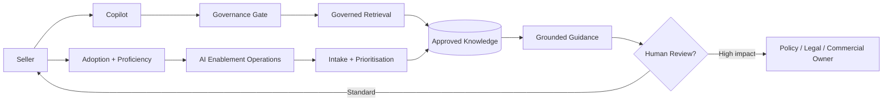

# SellerAI — Governed APAC Sales Enablement at Scale

> A reference architecture for AI-native sales enablement across a **simulated 530-seller APAC organisation**, combining governed retrieval, human-in-the-loop controls, enablement operations, vendor governance, adoption analytics and proficiency measurement.

**Important:** the 530 sellers and vendor organisations are synthetic. This project demonstrates architecture and operating-model capability; it does not claim a real production deployment to 530 sellers.

## Why this project exists

Enterprise AI enablement is not just a chatbot problem. A useful system has to answer five questions:

1. **Can sellers find the right approved knowledge at the moment of need?**
2. **Can the system abstain or escalate when it should not answer?**
3. **Can enablement teams see adoption, proficiency and regional friction?**
4. **Can requests be classified and routed instead of becoming an unmanaged backlog?**
5. **Can the same operating model extend across internal and outsourced seller teams?**

SellerAI demonstrates those capabilities in one runnable reference implementation.


## Phase 2 — Governance Operating System

Phase 2 adds a model/agent inventory, AI risk register, control assurance, incident management, an offline evaluation harness, adaptive spaced-learning reinforcement, and a grounded-generation abstraction. See [`docs/PHASE2.md`](docs/PHASE2.md).

## What it demonstrates

- Governed AI knowledge assistant
- Context-aware retrieval by market, segment and seller role
- Approved-source-only retrieval
- Source ownership and review-date traceability
- Sensitive-data blocking
- High-impact human-review routing
- Abstention when approved evidence is unavailable
- AI-assisted enablement intake and prioritisation
- 530 synthetic sellers across 8 APAC markets
- Internal + outsourced vendor scorecards
- Adoption, proficiency and certification analytics
- Audit IDs for governance decisions
- CI tests and Docker packaging


## Phase 2.1 — Learning-to-Scale Lab

The repository now includes a closed-loop **top-performer learning → human validation → LLM/knowledge/module update → red-team → offline evaluation → controlled cohort → progressive rollout** workflow.

This is designed around mature contact-centre/BPO practices: QA evidence, targeted coaching, proficiency measurement, microlearning, trainer calibration and continuous improvement. Raw interaction data does **not** automatically train the model.

Key additions:
- 10-module BPO sales learning track
- Synthetic top-performer cohort analysis
- Candidate learning-signal backlog
- Human SME/policy approval gates
- Versioned LLM/knowledge/module update lifecycle
- Red-team and offline evaluation gates
- A/B/cohort testing model
- 10% → 25% → 50% → 100% progressive rollout with rollback
- Multi-dimensional scale metrics: groundedness, policy safety, retrieval, proficiency, QA, adoption, experience, latency, cost and incidents

See [`docs/BPO_LEARNING_TO_SCALE.md`](docs/BPO_LEARNING_TO_SCALE.md).


## Architecture



See [`docs/ARCHITECTURE.md`](docs/ARCHITECTURE.md) for the detailed design.

## AI governance by design

The control model is informed by the **NIST AI Risk Management Framework / Generative AI Profile** and Singapore's **IMDA Model AI Governance Frameworks for Generative AI and Agentic AI**.

The implementation demonstrates:
- accountability and named ownership,
- bounded AI behavior,
- approved-source retrieval,
- human checkpoints,
- source provenance,
- lifecycle review,
- risk-based routing,
- end-user transparency,
- auditability,
- testing.

See [`docs/GOVERNANCE.md`](docs/GOVERNANCE.md).

## Run locally

```bash
python -m venv .venv
# macOS/Linux
source .venv/bin/activate
# Windows PowerShell
# .venv\Scripts\Activate.ps1

pip install -r requirements.txt
streamlit run app/main.py
```

## Run tests

```bash
pytest -q
```

## Docker

```bash
docker build -t sellerai .
docker run -p 8501:8501 sellerai
```

## Suggested demo flow

1. Open **Seller Copilot** and ask a normal discovery question.
2. Inspect approved knowledge sources and traceability.
3. Ask for a **pricing exception** to trigger human review.
4. Enter an email address to demonstrate the sensitive-data gate.
5. Open **Enablement Operations** to show adoption/proficiency metrics.
6. Open **Scale & Vendor Governance** to compare internal and outsourced teams.

## Repository map

```text
sellerai-governed-enablement/
├── app/
│   ├── main.py
│   ├── governance.py
│   ├── retrieval.py
│   ├── intake.py
│   ├── synthetic.py
│   ├── lifecycle.py
│   └── alerts.py
├── data/
│   └── knowledge_base.csv
├── docs/
│   ├── ARCHITECTURE.md
│   ├── GOVERNANCE.md
│   ├── SCALE.md
│   ├── AGENT_LIFECYCLE_GOVERNANCE.md
│   └── STEP3_ALERTS_HUMAN_ESCALATION.md
├── tests/
├── .github/workflows/tests.yml
├── Dockerfile
└── requirements.txt
```

## System scope


> SellerAI is a governed AI-native sales-enablement reference architecture for a simulated 500+ seller APAC organisation, integrating context-aware knowledge retrieval, human-in-the-loop controls, automated enablement intake, vendor governance, lifecycle controls and adoption/proficiency analytics.


## Current Phase 2 capabilities

- Grounded-generation abstraction with approved-source-only evidence
- AI/model/agent inventory
- AI risk register and control library
- Control assurance results
- Incident and corrective-action log
- Evaluation harness for retrieval, routing, leakage, grounding, latency and cost telemetry
- Adaptive spaced-learning reinforcement
- Vendor adoption/proficiency/certification governance
- Human/BPO Joiner-Mover-Leaver lifecycle governance
- AI-agent onboarding, permissioning, change control, kill switch and retirement
- Access-review, excess-privilege and orphan-identity controls
- Step 3 alert and human-escalation control plane with explicit AI/human scope boundaries, trigger rules, owners, SLAs and audit evidence

## Step 3 — Alerts & Human Escalation

SellerAI explicitly separates **AI-in-scope assistance** from **human-only
authority**. The alert control plane monitors the simulated seller/AI-agent
environment for boundary crossings such as pricing exceptions, legal or policy
interpretation, sensitive data, expired knowledge, generated-answer conflicts,
unapproved AI-agent permissions, seller role/vendor changes and offboarding.

When a boundary is crossed, the AI performs only the permitted containment
action — for example **abstain, deny, block, retrieve approved policy, calculate
an access delta or trigger revocation** — then creates an alert for a named
human owner. Every alert carries severity, subject, market, vendor, trigger,
AI action, accountable owner, SLA, status and audit evidence.

This makes human accountability operational rather than simply describing the
system as “human-in-the-loop.”

## Future Build

The next planned release will extend SellerAI from governed enablement into a
closed-loop enterprise learning and localization system.

### QA Interaction Intelligence
Analyze synthetic or appropriately governed interaction transcripts at scale,
score interactions against a configurable QA rubric, identify recurring skill
and knowledge gaps, compare cohort patterns, and recommend targeted coaching.
Interaction evidence will generate **candidate learning signals** rather than
automatically changing the LLM or knowledge base.

### Champion / SME Network
Introduce a formal regional operating model linking Global Enablement, APAC
Enablement, market AI Champions, Product/Policy SMEs, vendor enablement leads,
trainers and sellers. The workflow will track ownership, SLA, escalation,
validation, approval and whether a locally identified learning should be
promoted to regional or global guidance.

### Localization Governance — One Global Module
Create one controlled global source module with governed market variants.
Proposed lifecycle:

```text
Global approved module
        ↓
Localization request
        ↓
Market context + language adaptation
        ↓
Local SME / Policy validation
        ↓
Translation and retrieval evaluation
        ↓
Controlled market cohort
        ↓
Regional governance approval
        ↓
Market release
        ↓
Telemetry / drift / feedback
        ↺
Global learning review
```

The design will preserve a global source-of-truth, version lineage and approval
history while allowing market-specific legal, language, cultural, product and
commercial context. Local changes will not silently overwrite global guidance.

### Additional planned capabilities
- AI Experiment Registry with hypothesis, version, control cohort, safety gates,
  decision and rollback history
- Executive AI Enablement Dashboard linking adoption, proficiency, QA, outcome
  proxies, risk incidents, latency and cost
- Multilingual APAC retrieval and evaluation
- Policy-as-code and role/market/vendor access controls
- Persistent audit logging and release lineage


## Roadmap — Phase 3 productionization

- Replace local TF-IDF retrieval with production vector retrieval
- Add enterprise model gateway with authenticated provider integration
- Add SSO and RBAC/ABAC
- Persist incidents, approvals and immutable audit events
- Add multilingual APAC evaluation and red-team test packs
- Add production cost/latency/quality observability and alerting
- Add policy-as-code service and approval workflow

## Governance references

- NIST AI RMF: https://www.nist.gov/itl/ai-risk-management-framework
- NIST Generative AI Profile: https://www.nist.gov/publications/artificial-intelligence-risk-management-framework-generative-artificial-intelligence
- Singapore IMDA AI governance: https://www.imda.gov.sg/about-imda/emerging-technologies-and-research/artificial-intelligence

## Intellectual Property and License

Copyright © 2026 Vanessa Miranda. **All intellectual property rights in SellerAI,
including the source code, architecture, documentation, workflows, control
designs, data schemas and original project materials, are reserved by Vanessa
Miranda to the fullest extent permitted by applicable law.**

The repository is source-available for viewing and evaluation only. No license
is granted to copy, modify, merge, publish, distribute, sublicense, sell, host,
commercialize, train on, create derivative works from, or use the Software in
production without prior written permission from the rights holder.

See [`LICENSE`](LICENSE) for the full terms.