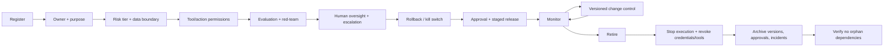

# Agent Lifecycle Governance

SellerAI governs two identity classes: **human/BPO sales agents** and **AI agents**.

## Human/BPO Joiner-Mover-Leaver

```mermaid
flowchart LR
    J[Joiner] --> V[Verify identity + sponsor]
    V --> R[Role / market / vendor]
    R --> P[Least-privilege RBAC]
    P --> T[Training + AI acceptable use]
    T --> C[Certification]
    C --> A[Production access]
    A --> M[Mover event]
    M --> D[Calculate access delta]
    D --> X[Revoke obsolete access]
    X --> N[Approve new access + recertify]
    N --> L[Leaver event]
    L --> Z[Revoke SSO/apps/sessions/tokens]
    Z --> E[Transfer work + retain audit evidence]
    E --> Q[Zero-residual-access attestation]
```

A mover is treated as an access **replacement**, not an accumulation event.

## AI Agent Lifecycle

## Core controls

- least privilege,
- segregation of duties,
- certification before production access,
- time-bounded access where appropriate,
- role/market/vendor access boundaries,
- periodic access review,
- immediate leaver revocation,
- residual-access and orphan-account checks,
- named owner for every AI agent,
- bounded AI permissions,
- evaluation/red-team gate,
- human oversight,
- kill switch/rollback,
- versioned change approval,
- retirement evidence.

The implementation uses synthetic records and is a reference architecture.
