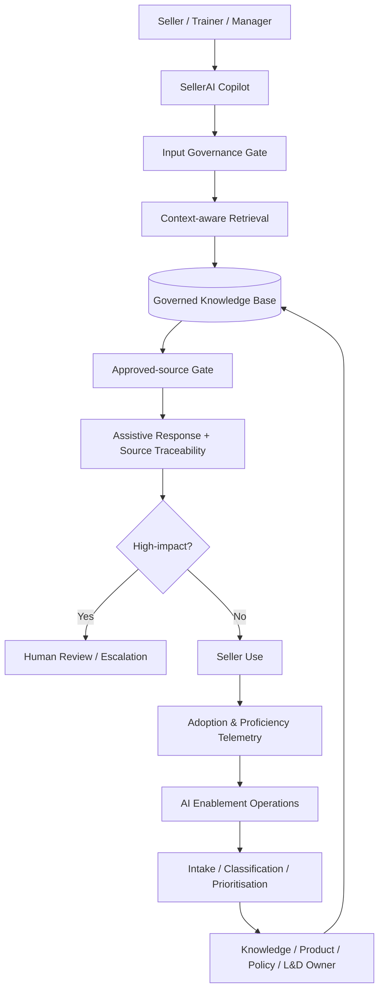

# Architecture

## Scale model

The demo generates 530 synthetic seller records across eight APAC markets, internal sales and three fictional outsourced vendors. This is a **reference architecture**, not a claim of real-world deployment to 530 people.

## Separation of concerns

- `retrieval.py`: approved-source retrieval and contextual ranking
- `governance.py`: risk classification, human-review rules, sensitive-data blocking and audit ID
- `intake.py`: enablement-request classification and routing
- `synthetic.py`: reproducible synthetic operating dataset
- `main.py`: demonstration UI and dashboards

## Production evolution

A production implementation would separate the UI, retrieval service, policy engine, identity/RBAC, telemetry, model gateway and audit store; use managed secrets; add authentication; use a production vector database; run offline/online evaluations; and integrate approved enterprise knowledge and CRM systems.
