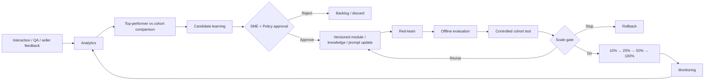

# BPO Sales Learning-to-Scale Operating Model

## Design principle

The system **does not self-train on raw seller or customer interactions**. Performance signals generate candidate learnings. A human SME/policy owner validates the learning before it can change approved knowledge, prompts/context, learning modules, or routing rules.

## Learning track

1. Foundation & certification
2. Discovery excellence
3. Solution/value selling
4. Objection handling
5. Commercial/compliance discipline
6. AI Copilot mastery
7. QA-calibrated coaching
8. Spaced reinforcement
9. Top-performer learning loop
10. Train-the-trainer / vendor scale

## Closed-loop operating model

## What can be updated

- Knowledge article / source corpus
- Retrieval metadata
- Prompt/context template
- Microlearning module
- Assessment question bank
- Escalation/routing policy

A model-weight update is a separate, higher-risk lifecycle and is **not** performed automatically by this reference implementation.

## Scale decision

A scale decision considers quality, safety, learning, experience, operations, cost and risk together. Adoption alone is not success.

## BPO governance

Vendor trainers require certification and calibration. Localisation is controlled. Content currency and escalation SLAs are monitored. QA and proficiency gaps feed targeted learning rather than generic retraining.
