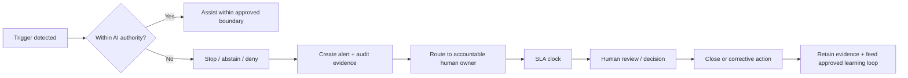

# Step 3 — Alerts & Human Escalation

Step 3 makes the boundary between AI assistance and human accountability explicit
for the simulated 500+ seller environment.

## Scope boundary

### AI in scope
- retrieve and summarize approved knowledge,
- recommend only within approved policy boundaries,
- classify and route,
- identify knowledge/proficiency gaps,
- personalize approved learning,
- generate alerts,
- abstain when evidence or authority is insufficient.

### Out of AI scope / human accountability
- pricing and discount exception approval,
- legal interpretation or contract approval,
- policy override,
- high-risk production release approval,
- employment or disciplinary decisions,
- privileged-access approval,
- residual-risk acceptance.

## Alert lifecycle

## Minimum alert record
Every alert records:
- alert ID,
- seller or AI-agent ID,
- market,
- vendor,
- trigger,
- severity,
- AI action,
- explicit out-of-scope boundary,
- human owner,
- SLA,
- status,
- audit ID/evidence.

## Severity
**RED** — AI must stop, deny, block or abstain and route promptly because the
request crosses an authority, legal, policy, data, security or high-impact
boundary.

**YELLOW** — AI can perform a bounded supporting action, but a named human must
review or approve the next step.

The reference implementation uses synthetic identities, vendors, alerts and
outcomes. It does not claim production monitoring of real sellers.
